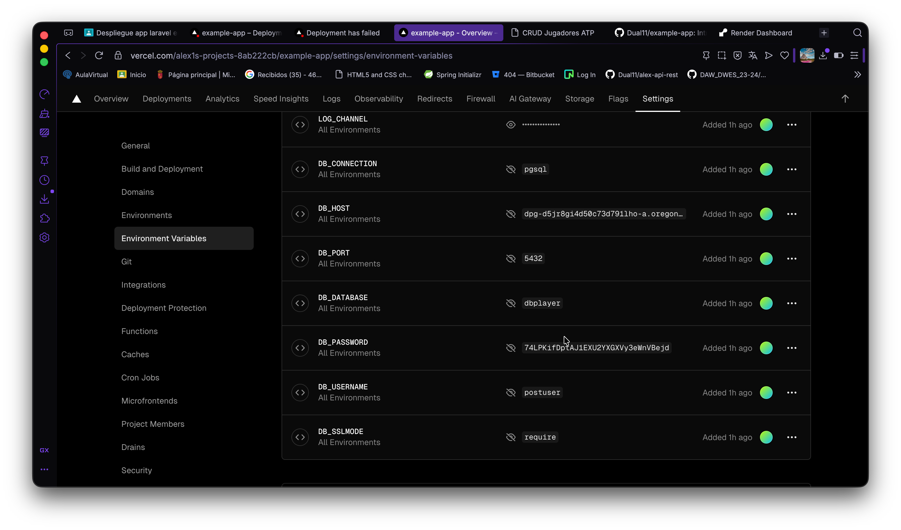
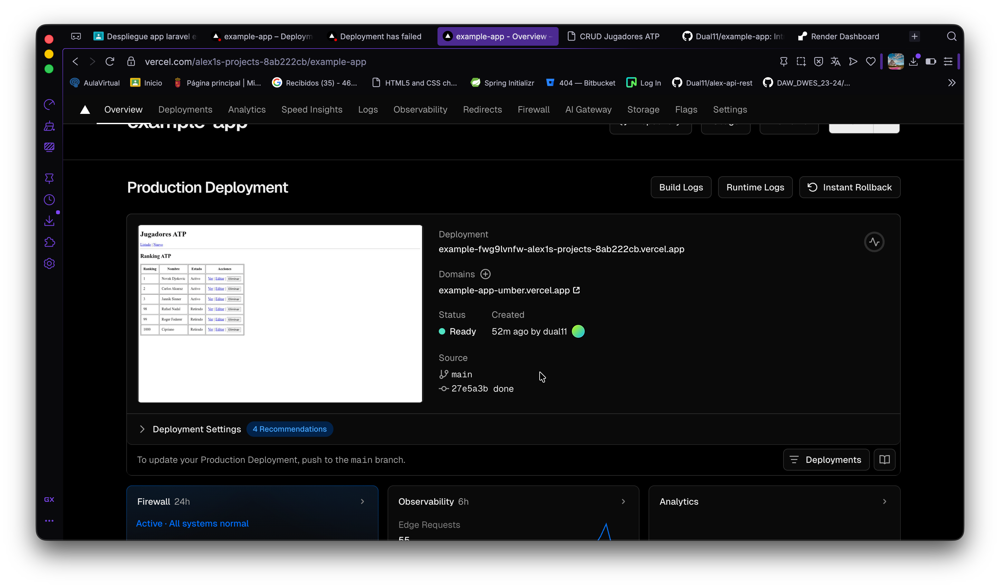

# Deployment en Vercel
- Utilizando el mismo trabajo de antes y modificando algunas cosas
- He creado y añadido esto
- api/index.php
```
  <?php

// Carga Composer autoload (obligatorio)
require __DIR__ . '/../vendor/autoload.php';

// Opcional: fuerza production
$_ENV['APP_ENV'] = $_ENV['APP_ENV'] ?? 'production';
$_SERVER['APP_ENV'] = 'production';

// Forward directo a Laravel
require __DIR__ . '/../public/index.php';
```

# Luego lo he usado el vercel.json
- Segun entiendo, es como el Dockerfile, donde se tiene todas las rutas y las dependencias necesarias
- para que todo se levante correcto
```
{
    "version": 2,
    "functions": {
        "api/*.php": {
            "runtime": "vercel-php@0.9.0"
        }
    },
    "routes": [
        {
            "src": "/build/(.*)",
            "dest": "/public/build/$1"
        },
        {
            "src": "/(.*)",
            "dest": "/api/index.php"
        }
    ],
    "env": {
        "APP_ENV": "production",
        "APP_DEBUG": "false",
        "CACHE_DRIVER": "array",
        "SESSION_DRIVER": "cookie",
        "VIEW_COMPILED_PATH": "/tmp",
        "APP_CONFIG_CACHE": "/tmp/config.php",
        "APP_EVENTS_CACHE": "/tmp/events.php",
        "APP_PACKAGES_CACHE": "/tmp/packages.php",
        "APP_ROUTES_CACHE": "/tmp/routes.php",
        "APP_SERVICES_CACHE": "/tmp/services.php",
        "LOG_CHANNEL": "stderr"
    }
}
```
# Tambien he creado el .verceignore
- 

```node_modules
vendor
.env
storage/*
bootstrap/cache/*
public/build/*
```

# He añadido una linea mas en el archivo parckage.json
- He añadido esto - "vercel-build": "npm ci && npm run build"
```
{
    "$schema": "https://www.schemastore.org/package.json",
    "private": true,
    "type": "module",
    "scripts": {
        "build": "vite build",
        "dev": "vite",
        "vercel-build": "npm ci && npm run build"
    },
    "devDependencies": {
        "@tailwindcss/vite": "^4.0.0",
        "axios": "^1.11.0",
        "concurrently": "^9.0.1",
        "laravel-vite-plugin": "^2.0.0",
        "tailwindcss": "^4.0.0",
        "vite": "^7.0.7"
    }

}


```
# Luego he usado la base de datos en la nube de Render, psgsql
- He usado las variables, como en render para que se conecte a la base de datos en la nube
- 



# Resultado final
- se puede ver que ha desplegado correctamente

