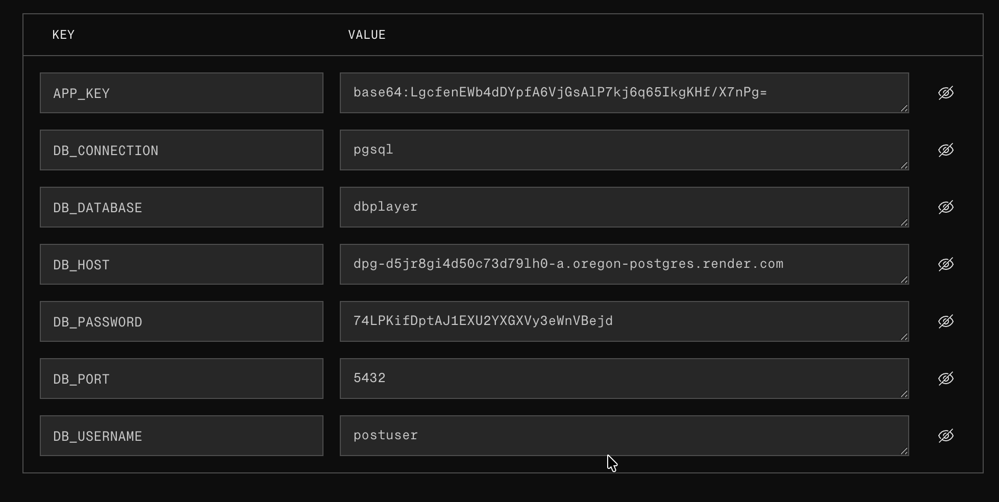

# - Laravel + Docker + Render

# OBJETIVO
- El objetivo de este projecto es agregarlo a un contenedor de **docker - local**
- Usando **Postgresql**
- Luego despegarlo en **Render** con **web service** y la base de datos en la nube


# Lo primero que he creado fue el docker-compose.local.yml
- Este son los datos a añadir para crearlo en local


```services:
  db:
    image: postgres:18
    container_name: postgres_example
    restart: always
    environment:
      POSTGRES_USER: postuser
      POSTGRES_PASSWORD: 1234
      POSTGRES_DB: dbplayer
    ports:
      - "5434:5432"
```

# Luego levantamos el contenedor y ver si lo mantiene
```docker-compose -f docker-compose.local.yml up --build```

# Intalar las dependecias del proyecto

```php artisan migrate```

# Levantar el projecto y ver si todo ha ido bien

```php artisan serve ```

# Proyecto  en Render
- Tambien utilizamos el docker-compose.dev.yml

```
services:
  #CONTENEDOR BASE DE DATOS POSTGRES_DEV
  db-dev:
    image: postgres:16
    container_name: postgres_dev
    restart: always
    environment:
      POSTGRES_DB: laravel
      POSTGRES_USER: user
      POSTGRES_PASSWORD: 1234
    ports:
      - "5432:5432"

  # CONTENEDOR DE LA APP LARAVEL_DEV
  app-dev:
    build:
      context: .
      dockerfile: Dockerfile
    container_name: laravel_dev
    depends_on:
      - db-dev
    ports:
      - "8080:8000"
    environment:
      #AQUI CAMBIAMOS HOST POR EL NOMBRE DEL CONTENEDOR DE LA BASE DE DATOS POSTGRES_DEV
      DB_CONNECTION: pgsql
      DB_HOST: db-dev
      DB_PORT: 5432
      DB_DATABASE: laravel
      DB_USERNAME: user
      DB_PASSWORD: 1234
      APP_KEY: ${APP_KEY}
      APP_ENV: local
      APP_DEBUG: "true"


```
- Para levantarlo en Render he creado el Dockerfile
```# COGEMOS LA IMAGEN DE PHP
FROM php:8.2-fpm

# INSTALAMOS LAS DEPENDENCIAS
RUN apt-get update && apt-get install -y \
    git curl zip unzip libpng-dev libonig-dev libxml2-dev libzip-dev libicu-dev libpq-dev \
    nodejs npm \
    && docker-php-ext-install pdo pdo_pgsql mbstring zip exif pcntl gd intl \
    && apt-get clean && rm -rf /var/lib/apt/lists/* # 2. Instalar Composer
COPY --from=composer:latest /usr/bin/composer /usr/bin/composer

# DIRECTORIO DE TRABAJO
WORKDIR /var/www

# AQUÍ COPIAMOS ARCHIVOS
COPY . .

# DEPENDENCIAS DE PHP Y NODE QUE ES LO QUE UTILIZAMOS
RUN composer install --optimize-autoloader --no-interaction
RUN npm install && npm run build

# PERMISOS PARA EVITAR ERRORES FUTUROS CON EL TEMA PERMISOS
RUN chown -R www-data:www-data /var/www/storage /var/www/bootstrap/cache

# PUERTO
EXPOSE 8000

# COMANDO FINAL ; Esperamos 10 segundos, migra con datos de prueba y arranca
CMD sh -c "sleep 10 && php artisan migrate:fresh --seed --force && php artisan serve --host=0.0.0.0 --port=8000"
```

# En Render  hay que añadir estas varibales y la de la base de datos en la nube

```

```
- Al desplegarlo en render, tuve el problema de no crear el .dockerignore
- El servicio se levantaba, pero intentaba conectarse al local


